# Albrus-Tlz
(:3[▓▓▓▓▓▓▓▓]
> Systematically study the idea of multi-threaded concurrency and practice and record to deepen understanding.

## 一、JUC概述和进程线程概念

### 1.1 JUC

`java.util.concurrent`

### 1.2 进程与线程概念

#### 1.2.1 进程与线程

进程：指在系统中正在运行的一个应用程序；进程 - 资源分配的最小单位。

线程：系统分配处理器时间资源的基本单元；线程 - 进程运行的最小单位。

#### 1.2.2 线程的状态

```java
public enum State {
    /**
     * Thread state for a thread which has not yet started.
     */
    NEW,

    /**
     * Thread state for a runnable thread.  A thread in the runnable
     * state is executing in the Java virtual machine but it may
     * be waiting for other resources from the operating system
     * such as processor.
     */
    RUNNABLE,

    /**
     * Thread state for a thread blocked waiting for a monitor lock.
     * A thread in the blocked state is waiting for a monitor lock
     * to enter a synchronized block/method or
     * reenter a synchronized block/method after calling
     * {@link Object#wait() Object.wait}.
     */
    BLOCKED,

    /**
     * Thread state for a waiting thread.
     * A thread is in the waiting state due to calling one of the
     * following methods:
     * <ul>
     *   <li>{@link Object#wait() Object.wait} with no timeout</li>
     *   <li>{@link #join() Thread.join} with no timeout</li>
     *   <li>{@link LockSupport#park() LockSupport.park}</li>
     * </ul>
     *
     * <p>A thread in the waiting state is waiting for another thread to
     * perform a particular action.
     *
     * For example, a thread that has called <tt>Object.wait()</tt>
     * on an object is waiting for another thread to call
     * <tt>Object.notify()</tt> or <tt>Object.notifyAll()</tt> on
     * that object. A thread that has called <tt>Thread.join()</tt>
     * is waiting for a specified thread to terminate.
     */
    WAITING,

    /**
     * Thread state for a waiting thread with a specified waiting time.
     * A thread is in the timed waiting state due to calling one of
     * the following methods with a specified positive waiting time:
     * <ul>
     *   <li>{@link #sleep Thread.sleep}</li>
     *   <li>{@link Object#wait(long) Object.wait} with timeout</li>
     *   <li>{@link #join(long) Thread.join} with timeout</li>
     *   <li>{@link LockSupport#parkNanos LockSupport.parkNanos}</li>
     *   <li>{@link LockSupport#parkUntil LockSupport.parkUntil}</li>
     * </ul>
     */
    TIMED_WAITING,

    /**
     * Thread state for a terminated thread.
     * The thread has completed execution.
     */
    TERMINATED;
}
```

#### 1.2.3 `wait & sleep`

`wait`：`Thread.sleep()`，会释放锁，前提是在同步代码块中执行

`sleep`：`Object.wait()`，不会释放锁也不需要占有锁

在哪儿睡在哪儿醒，都能被 `interrupted()` 中断。

#### 1.2.4 并发和并行

并发 - 同一时刻多个线程在访问同一资源

并行 - 多项工作一起执行，之后再汇总

#### 1.2.5 管程

管程 - Monitor 监视器

是一种同步机制，保证同一时刻只有一个线程对受保护的数据进行访问。

==**JVM中的同步，基于进入和退出过程，使用管程对象来实现（加锁、释放锁）**==，也就是说，每一个对象都有一个管程对象（随着Java对象创建而创建）

**执行同步操作时，需要先获取管程对象，当持有管程对象后，才能进入被加锁的操作。当一个线程持有管程对象后，其他线程不能再获取同一个管程对象。当操作执行完成后，再释放管程对象其他线程才能尝试访问（获取锁）。**

#### 1.2.6 用户线程 & 守护线程

用户线程 - `new Thread` 自定义线程

守护线程 - 例如垃圾回收

- `Thread.isDaemon()` 判断是否是守护线程。

- 主线程结束，用户线程还存活 - JVM存活

  ```java
  public static void main(String[] args) {
      Thread t = new Thread(() -> {
          // false
          Thread.currentThread().isDaemon();
          while (true) {}
      }, "deemo-thread-01");
      
      t.start();
  }
  // 此时运行 `main()` 方法，JVM将一直等待用户线程结束
  ```

- 没有用户线程之后，JVM结束

  ```java
  public static void main(String[] args) {
      Thread t = new Thread(() -> {
          // true
          Thread.currentThread().isDaemon();
          while (true) {}
      }, "deemo-thread-01");
      
      t.setDaemon(true);
      t.start();
  }
  // 此时运行 `main()` 方法，JVM将结束
  ```

## 二、Lock接口

```java
interface Lock
    ReentrantLock implements Lock
    ReentrantReadWriteLock.ReadLock implements Lock
    ReentrantReadWriteLock.WriteLock implements Lock
```

`Lock` 与 `synchronized`：

- `synchronized` 是Java中的关键字
- `synchronized` 隐式锁，不需要手动释放锁
- `Lock` 使用更灵活（`wait & notifyAll`），但需要手动释放锁

## 三、集合的线程安全

### 3.1 `List`

`ArrayList`

`CopyOnWriteArrayList`

- 在 `add` 等数据修改操作才会加锁 `ReentrantLock.lock()`

- 遍历时，将现有的数组**赋值创建一个新的迭代器**

  ```java
  /**
   * Returns an iterator over the elements in this list in proper sequence.
   *
   * <p>The returned iterator provides a snapshot of the state of the list
   * when the iterator was constructed. No synchronization is needed while
   * traversing the iterator. The iterator does <em>NOT</em> support the
   * {@code remove} method.
   *
   * @return an iterator over the elements in this list in proper sequence
   */
  public Iterator<E> iterator() {
      return new COWIterator<E>(getArray(), 0);
  }
  ```

### 3.2 `Set`

`HashSet`

`CopyOnWriteArraySet`

### 3.3 `Map`

`HashMap`

`ConcurrentHashMap`

## 四、多线程锁

### 4.1 synchronized

修饰不同的地方的不同效果

非同一个对象时的效果（非同一把锁）

### 4.2 公平锁、非公平锁

```java
/**
 * Creates an instance of {@code ReentrantLock}.
 * This is equivalent to using {@code ReentrantLock(false)}.
 */
public ReentrantLock() {
    sync = new NonfairSync();
}

/**
 * Creates an instance of {@code ReentrantLock} with the
 * given fairness policy.
 *
 * @param fair {@code true} if this lock should use a fair ordering policy
 */
public ReentrantLock(boolean fair) {
    sync = fair ? new FairSync() : new NonfairSync();
}
```

- 公平锁减少**“饥饿”**现象

  里面维护了一个队列，用于判断 `head` 是否是当前线程

  ```java
  public final boolean hasQueuedPredecessors() {
      // The correctness of this depends on head being initialized
      // before tail and on head.next being accurate if the current
      // thread is first in queue.
      Node t = tail; // Read fields in reverse initialization order
      Node h = head;
      Node s;
      return h != t &&
          ((s = h.next) == null || s.thread != Thread.currentThread());
  }
  ```

- 非公平锁减少线程切换，效率更高

### 4.3 可重入锁

可重入锁、递归锁。

`synchroinzed & ReentrantLock & ReentrantReadWriteLock` 都是可重入锁。

### 4.4 死锁

死锁：两个或两个以上的线程在执行过程中，同时取争夺对方的资源形成循环造成的一直等待。

- 互斥

- 占有且等待

  在持有共享资源A的同时在等待共享资源B且不释放共享资源A

- 不可抢占

  其他线程不能抢占

- 循环等待

  T1 > T2 > T1

分析：`jps & jstack`

解决：**只要破坏四大条件中的其中一个，便能解决死锁问题：**

- 互斥：不可碰

- 占有且等待

  一次性申请所有的资源（引入一个公共颁发资源的角色）

- 不可抢占

  在占用部分共享资源的线程进一步申请其他共享资源时，如果申请不到，则主动释放持有的共享资源

- 循环等待

  按顺序申请资源，例如按ID排序后申请共享资源

## 五、辅助类

### 5.1 CountDownLatch

计数器，初始化设置一个计数量，每次调用 `countDown` 方法将计数量**减一**，使用 `await` 方法等待，当计数量恢复到0时线程被唤醒。

```java
CountDownLatch countDownLatch = new CountDownLatch(6);

for (int i = 0; i < 6; i++) {
    new Thread(() -> {
        try {
            TimeUnit.SECONDS.sleep(new Random().nextInt(5));
        } catch (InterruptedException e) {
            throw new RuntimeException(e);
        }

        System.out.println("小小" + Thread.currentThread().getName().split("-")[1] + "离开了教室。。。");
        countDownLatch.countDown();
    }, "thread-0" + i).start();
}

try {
    countDownLatch.await();
} catch (InterruptedException e) {
    System.out.println("女朋友叫班长不等了。。。");
    throw new RuntimeException(e);
}

System.out.println("人都走完了，班长该锁门了。");
```

### 5.2 CyclicBarrier

与 `CountDownLatch` 类似，初始化设置一个目标信号量，每次 `await` 时信号量将**加一**并等待，当达到目标信号量时，所有等待的线程都将被唤醒。

```java
CyclicBarrier cyclicBarrier = new CyclicBarrier(7, () -> {
    System.out.println("召~唤$神%龙！！！！！！");
});

for (int i = 0; i < 7; i++) {
    new Thread(() -> {
        try {
            TimeUnit.SECONDS.sleep(new Random().nextInt(5));
        } catch (InterruptedException e) {
            throw new RuntimeException(e);
        }

        System.out.println(Thread.currentThread().getName().split("-")[1] + " 星龙珠找到了！");
        try {
            cyclicBarrier.await();
        } catch (InterruptedException | BrokenBarrierException e) {
            System.out.println("不等待召唤神龙了。。。");
            throw new RuntimeException(e);
        }
        System.out.println(Thread.currentThread().getName().split("-")[1] + " 星龙珠又消失了^~");
    }, "thread-0" + i).start();
}
```

### 5.3 小总结

> 阻塞操作，建议设置超时时间。

前两个辅助类怎么理解它的实用性呢？

列举一个场景：**用户下单为订单库，物流派单为派单库，为防止出现漏发错发的问题，需要每天进行订单库和派单库对账。**

1. 方案一：串行处理

   ```java
   while (存在未对账的订单) {
       // 查询未对账订单
       pos = getPOrders();
       // 查询派送单
       dos = getDOrders();
       // 对账
       diff = check(pos, dos);
       // 差异写库
       save(diff);
   }
   ```

   存在的问题：由于订单量和派单量数量都很大，查询效率很低，导致对账很慢。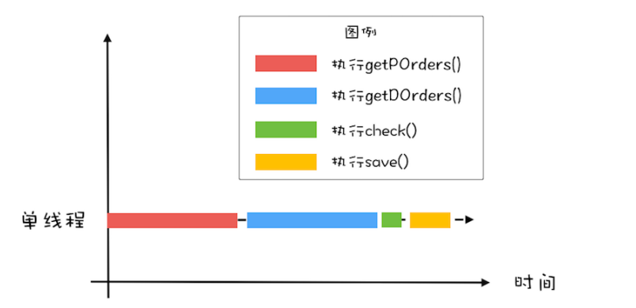

2. 方案二：多线程粗粗步拆解

   对方案一进行分析，瓶颈在于查询未对账订单和查询派送单两个操作，那么能不能把这两个操作改为并行处理行不行呢？答案是可以的，因为这两个操作没有先后依赖关系。将这两个操作拆分为并行后，执行效果如图：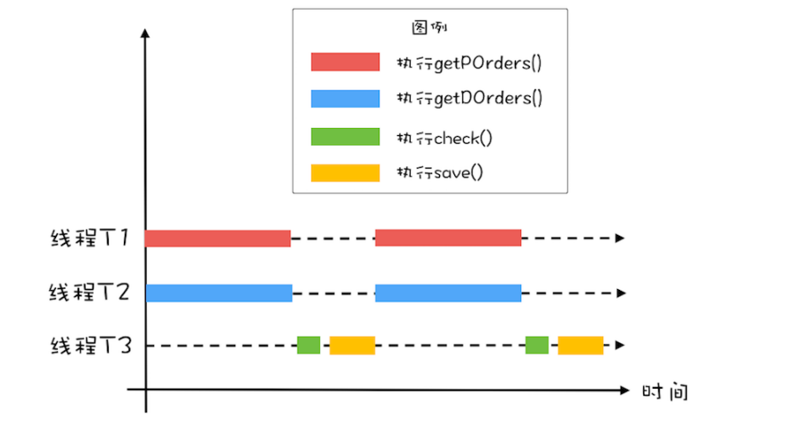

   可以发现，相同的等待时间内，并行执行的吞吐量近乎单线程的2倍。

   所优化的点：两个耗时查询并行查询，在忽略线程切换等环节带来的耗时时，并行执行节省了一次订单查询时间（节省相对较短的查询时间），也就是说只需要等待一次最长的查询时间即可。

   思路有了，接下来代码实现。新开两个线程T1 T2分别查询两种订单，线程T3便执行对账和差异写入操作，关键便是T3需要等待T1和T2执行结束才能执行。

   ```java
   while (存在未对账的订单) {
       // 查询未对账订单
       Thread t1 = new Thread(() -> {
           pos = getPOrders();
       });
       t1.start();
       // 查询派送单
       Thread t1 = new Thread(() -> {
           dos = getDOrders();
       });
       t2.start();
       
       // 等待
       t1.join();
       t2.join();
       
       // 对账
       diff = check(pos, dos);
       // 差异写库
       save(diff);
   }
   ```

3. 方案三：`CountDownLatch`

   在方案二已经提升了大部分性能，但美中不足的是每次都要创建新的线程，是一个比较重且浪费线程的操作，那么首先想到的便是线程池！是的，线程池的确可以解决这个问题，但问题是，使用线程池后怎样保证执行顺序问题？线程池没有提供 `join()` 方法，如何检测T1 T2执行结束呢 —— 计数器，每个查询执行完成后将计数器减一，当计数器为0时便是T3执行的时间，但无需重复造轮子了，呐：`CountDownLatch`

   ```java
   // 创建 2 个线程的线程池
   Executor executor = Executors.newFixedThreadPool(2);
   while (存在未对账的订单) {
       // 计数器初始化：2
       CountDownLatch latch = new CountDownLatch(2);
       
       // 查询未对账订单
       executor.execute(() -> {
           pos = getPOrders();
           latch.countDown();
       });
       // 查询派送单
       executor.execute(() -> {
           dos = getDOrders();
           latch.countDown();
       });
       
       // 等待
       latch.asait();
       
       // 对账
       diff = check(pos, dos);
       // 差异写库
       save(diff);
   }
   ```

4. 进一步优化性能——==**完全并行**==：`CyclicBarrier`

   进一步钻进去看，其实，两个查询操作和 `check() & save()` 操作之间也是可以并行的：当在 `check() & save()` 时又已经可以进行下一次查询了：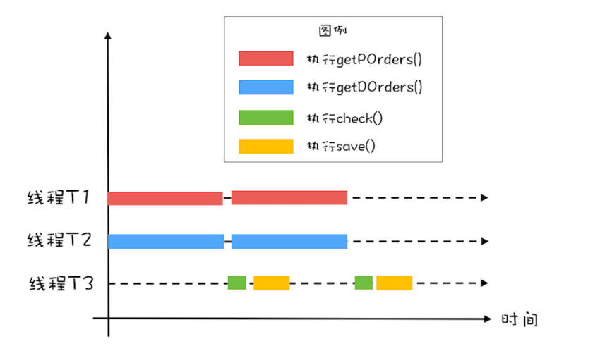

   完全并行，那么需要将T1 T2的查询结果用队列存储起来，T3从队列中获取订单 `check() & save()` 即可，那不就是生产者- 消费者模式了吗。

   队列设计：简单的来说，使用两个队列分别存储，但需要两个队列一一对应：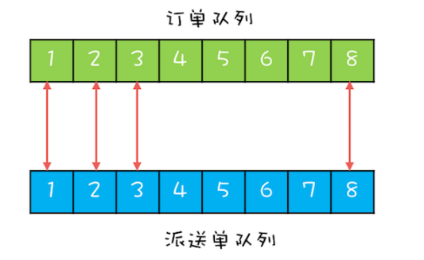

   双队列并行执行：T1执行订单查询，T2执行派单查询，都查询结束后通知T3执行对账检查。这个想法看似简单，但T1和T2的步调应该一致，不能一个太快一个太慢，需要T1和T2都查询一次结束后再通知T3进行对账检查：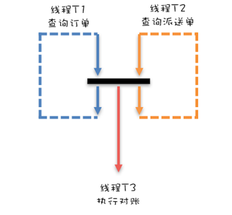

   有了想法便来实现。上述的方案两个难点：

   1. T1和T2需要步调一致
   2. 通知T3对账检查

   依然可以使用方案三的计数器来解决：循环利用计数器，将计数器后的对账检查提取为异步操作。但是同样的，不需要重复造轮子 —— 循环计数器 `CyclicBarrier`。

   `CyclicBarrier` 工具需要指定一个计数器，并传入一个回调函数，当计数器减到 0 时，将会触发回调函数，粗看与 `CountDownLatch` 并无差异，但重点便是 `CyclicBarrier` 有自动重置计数器的功能：当减到 0 时，待回调函数执行完成后重设初始值。

   `CountDownLatch` 的计数器是不能循环利用的，也就是说一旦计数器减到 0，再有线程调用 `await()`，该线程会直接通过。但 `CyclicBarrier` 的计数器是可以循环利用的，而且具备自动重置的功能，一旦计数器减到 0 会自动重置到你设置的初始值。

   ```java
   // 订单队列
   Vector<P> pos;
   // 派送单队列
   Vector<D> dos;
   // 执行回调的线程池
   Executor executor = Executors.newFixedThreadPool(1);
   final CyclicBarrier barrier = new CyclicBarrier(2, () -> {
       executor.execute(() -> check());
   });
   
   void check() {
       P p = pos.remove(0);
       D d = dos.remove(0);
       // 执行对账操作
       diff = check(p, d);
       // 差异写入差异库
       save(diff);
   }
   
   void checkAll() {
       // 循环查询订单库
       Thread T1 = new Thread(() -> {
           while (存在未对账订单) {
               // 查询订单库
               pos.add(getPOrders());
               // 等待
               barrier.await();
           }
       });
       T1.start();
       
       // 循环查询派单库
       Thread T2 = new Thread(() -> {
           while (存在未对账订单) {
               // 查询派单库
               dos.add(getDOrders());
               // 等待
               barrier.await();
           }
       });
       T2.start();
   }
   ```

   - 为什么需要一个 `Executors.newFixedThreadPool(1);` 线程池？
     - 异步啊！不异步不就同步了吗
     - 一个线程是因为两个队列的获取操作存在竞态条件

   - 循环计数器何时循环？当回调函数执行完成后，`CyclicBarrier.await()` 处都会被唤醒。

   - T3执行的时候是哪个线程执行？==**`CyclicBarrier` 的回调函数执行在一个回合的最后执行 `await()` 的线程上**==。
   
     ==**请遇到回调函数的时候一定要多想一想执行回调函数的是谁！！！**==

### 5.4 Semaphore

初始化设置一个许可集大小，每次 `acquire` 申请一个许可集（可一次性申请多个），如果没有则阻塞等待；每次 `release` 释放一个许可集（可一次性释放多个）。

通常用于限制可以访问某些资源（物理或逻辑）的线程数目。

```java
 // 三个许可证
Semaphore semaphore = new Semaphore(3);

for (int i = 0; i < 6; i++) {
    int finalI = i;
    new Thread(() -> {
        try {
            semaphore.acquire();
        } catch (InterruptedException e) {
            throw new RuntimeException(e);
        }

        System.out.println("第 " + finalI + " 辆车抢到了车位");

        try {
            TimeUnit.SECONDS.sleep(new Random().nextInt(5));
            System.out.println("第 " + finalI + " 辆车离开了车位");
        } catch (InterruptedException e) {
            throw new RuntimeException(e);
        } finally {
            semaphore.release();
        }
    }, "thread-0" + i).start();
}
```

## 六、读写锁

### 6.1 ReentrantReadWriteLock

> - 读共享
> - 写独占
> - 支持**==锁降级（同一个线程获取到写锁时也可以获取读锁）==**
> - **读写锁均可重入**
> - `ReadLock` 不支持 Condition：`java.lang.UnsupportedOperationException`

```java
// 读锁
ReentrantReadWriteLock.readLock().lock();
ReentrantReadWriteLock.readLock().unlock();
// 写锁
ReentrantReadWriteLock.writeLock().lock();
ReentrantReadWriteLock.writeLock().unlock();
```

锁降级：

```java
public void test() {
    ReentrantReadWriteLock readWriteLock = new ReentrantReadWriteLock();
    ReentrantReadWriteLock.WriteLock writeLock = readWriteLock.writeLock();
    ReentrantReadWriteLock.ReadLock readLock = readWriteLock.readLock();

    writeLock.lock();
    System.out.println("write...");

    // 0
    System.out.println(readWriteLock.getReadLockCount());
    // true
    System.out.println(readWriteLock.isWriteLocked());

    readLock.lock();
    System.out.println("read...");

    // 1
    System.out.println(readWriteLock.getReadLockCount());
    // true
    System.out.println(readWriteLock.isWriteLocked());

    writeLock.unlock();
    readLock.unlock();
}
```

- 可以成功运行结束，说明同一个线程获取到写锁时，也可以获取读锁
- 如果交换读写锁获取顺序，线程将**阻塞**

### 6.2 读写锁演变

> 一个资源可以被多个**读**线程访问或者被一个**写**线程访问，但不能同时存在读写操作，读写互斥、读读共享。

无锁 > 全锁 > 读写锁

线程不安全 > 性能差 > 写独占提高性能

### 6.3 StampedLock

> 写锁、悲观读锁、乐观读（不是乐观读锁，==**乐观读是无锁的**==）
>
> - 不支持直接锁升级、锁降级==**（同一个线程获取到写锁时，不能直接再获取读锁）**==，可通过 `tryConvertToReadLock & tryConvertToWriteLock` 降级或升级锁
> - **==写锁不可重入==**，悲观读锁可重入
> - 不支持 Condition
> - 具体使用时可参考JDK源码中的示例

```java
/**
 * Returns a stamp that can later be validated, or zero
 * if exclusively locked.
 *
 * @return a stamp, or zero if exclusively locked
 */
public long tryOptimisticRead() {
    long s;
    return (((s = state) & WBIT) == 0L) ? (s & SBITS) : 0L;
}

/**
 * Returns true if the lock has not been exclusively acquired
 * since issuance of the given stamp. Always returns false if the
 * stamp is zero. Always returns true if the stamp represents a
 * currently held lock. Invoking this method with a value not
 * obtained from {@link #tryOptimisticRead} or a locking method
 * for this lock has no defined effect or result.
 *
 * @param stamp a stamp
 * @return {@code true} if the lock has not been exclusively acquired
 * since issuance of the given stamp; else false
 */
public boolean validate(long stamp) {
    U.loadFence();
    return (stamp & SBITS) == (state & SBITS);
}

/**
 * If the lock state matches the given stamp, performs one of
 * the following actions. If the stamp represents holding a write
 * lock, returns it.  Or, if a read lock, if the write lock is
 * available, releases the read lock and returns a write stamp.
 * Or, if an optimistic read, returns a write stamp only if
 * immediately available. This method returns zero in all other
 * cases.
 *
 * @param stamp a stamp
 * @return a valid write stamp, or zero on failure
 */
public long tryConvertToWriteLock(long stamp) {
    long a = stamp & ABITS, m, s, next;
    while (((s = state) & SBITS) == (stamp & SBITS)) {
        if ((m = s & ABITS) == 0L) {
            if (a != 0L)
                break;
            if (U.compareAndSwapLong(this, STATE, s, next = s + WBIT))
                return next;
        }
        else if (m == WBIT) {
            if (a != m)
                break;
            return stamp;
        }
        else if (m == RUNIT && a != 0L) {
            if (U.compareAndSwapLong(this, STATE, s,
                                     next = s - RUNIT + WBIT))
                return next;
        }
        else
            break;
    }
    return 0L;
}

/**
 * If the lock state matches the given stamp, performs one of
 * the following actions. If the stamp represents holding a write
 * lock, releases it and obtains a read lock.  Or, if a read lock,
 * returns it. Or, if an optimistic read, acquires a read lock and
 * returns a read stamp only if immediately available. This method
 * returns zero in all other cases.
 *
 * @param stamp a stamp
 * @return a valid read stamp, or zero on failure
 */
public long tryConvertToReadLock(long stamp) {
    long a = stamp & ABITS, m, s, next; WNode h;
    while (((s = state) & SBITS) == (stamp & SBITS)) {
        if ((m = s & ABITS) == 0L) {
            if (a != 0L)
                break;
            else if (m < RFULL) {
                if (U.compareAndSwapLong(this, STATE, s, next = s + RUNIT))
                    return next;
            }
            else if ((next = tryIncReaderOverflow(s)) != 0L)
                return next;
        }
        else if (m == WBIT) {
            if (a != m)
                break;
            state = next = s + (WBIT + RUNIT);
            if ((h = whead) != null && h.status != 0)
                release(h);
            return next;
        }
        else if (a != 0L && a < WBIT)
            return stamp;
        else
            break;
    }
    return 0L;
}
```

一般使用乐观读的时候，先是获取乐观读，再执行业务，再判断乐观读之后的时间里是否有写操作 `validate`，如果有则升级为悲观读锁。**这里是升级为悲观读锁而不是循环执行乐观读，感觉是避免循环读浪费CPU**？但是本来就是写少读多？可能是如果某一时间点写较多，读的请求将一直被循环阻塞。一般建议便是使用该流程模板来使用乐观读。

理解这个乐观读可用对比数据库的乐观锁（版本号：`UPDATE x set version = version + 1 WHERE xxxx AND version = #{version};`）。这里的乐观读也是会生成一个 `stamp`，与数据库中的 `version` 有异曲同工之妙。

另外注意：==**如果线程阻塞在 `StampedLock.readLock() || StampedLock.writeLock()` 时调用该线程的 `interrupt()` 方法，将导致CPU飙升。**==所以如果需要支持中断操作，一定使用可终端的悲观读锁和写锁（`readLockInterruptibly & writeLockInterruptibly`）。

`StampedLock` 性能相比 `ReadWriteLock` 性能更好的原因是：前者支持乐观读。原理便是从实际业务出发认定业务系统中，某一部分数据的操作是读多写少，因此没必要每次读的时候都去消耗时间加读锁和释放读锁。于是在读取数据时，便从读取数据前记录一个 `stamp` （与数据库的 `version` 异曲同工之妙），假设没有人来写数据，在操作完之后便验证一次是否真的没人来写数据，如果真的没有便返回，如果有则升级为悲观读锁处理。**相比之下，性能提升的便是将每次的读锁处理优化为操作数据时是否有人来写过数据，是一个无锁操作。**

## 七、内置工具类

### 7.1 并发容器

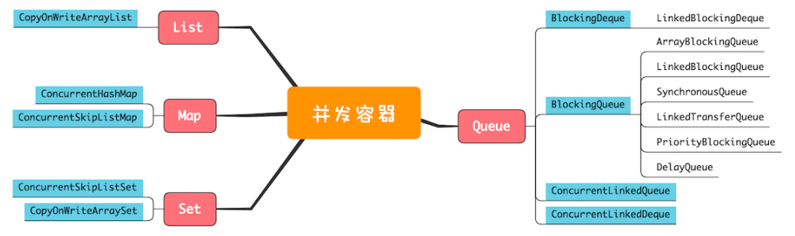

#### 7.1.1 List

`CopyOnWriteArrayList`：内部维护一个数组，在写数据时将使用重入锁 `ReentrantLock` 加锁，并且会先将原 array 数组拷贝一份，在新数组上操作写后再将 array 指向这个新数组。

因此可以总结出使用场景：

- ==**应适用于写操作很少的场景**==，因为每次写操作都会拷贝原数组
- **能够容忍短暂的读写不一致**
- **迭代器仅可读，不支持增删改**，因为迭代器提供的仅仅是一个快照，对快照进行增删改是没有意义的

#### 7.1.2 Map

Map 接口的两个实现是 `ConcurrentHashMap` 和 `ConcurrentSkipListMap`，它们从应用的角度来看，**主要区别在于`ConcurrentHashMap` 的 key 是无序的，而 `ConcurrentSkipListMap` 的 key 是有序的**。所以如果你需要保证 key 的顺序，就只能使用 `ConcurrentSkipListMap`。

使用 `ConcurrentHashMap` 和 `ConcurrentSkipListMap` 需要注意的地方是，**它们的 key 和 value 都不能为空**，否则会抛出 `NullPointerException` 这个运行时异常。

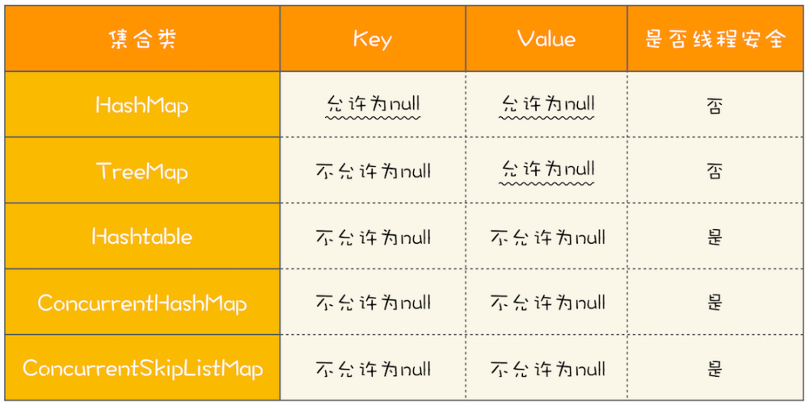

#### 7.1.3 Set

`Set` 接口的两个实现是 `CopyOnWriteArraySet` 和 `ConcurrentSkipLiskSet`，使用场景可以参考前文描述。

#### 7.1.4 Queue

可以从两个角度来分类：

- 阻塞与非阻塞，关键字：`Blocking`

  所谓阻塞指的是当队列已满时，入队操作阻塞；当队列已空时，出队操作阻塞

- 单端与双端，关键字：`Queue & Deque`

  单端指的是只能队尾入队，队首出队；而双端指的是队首队尾皆可入队出队

两个维度组合后，可以细分为四大类：

1. 单端阻塞队列

   `ArrayBlockingQueue`、`LinkedBlockingQueue`、`SynchronousQueue`、`LinkedTransferQueue`、`PriorityBlockingQueue` 和 `DelayQueue`

2. 双端阻塞队列

   `LinkedBlockingDeque`

3. 单端非阻塞队列

   `ConcurrentLinkedQueue`

4. 双端非阻塞队列

   `ConcurrentLinkedDeque`

==**使用时，应注意队列是否支持有界（一般不建议使用无界，容易OOM），只有 `ArrayBlockingQueue` 和 `LinkedBlockingQueue` 是支持有界的**==

#### 7.1.5 阻塞队列额外篇

> 在某些情况下挂起线程（阻塞），一旦条件满足时自动唤醒被挂起的线程。不用重复造轮子啦~~

##### 7.1.5.0 认识 BlockingQueue

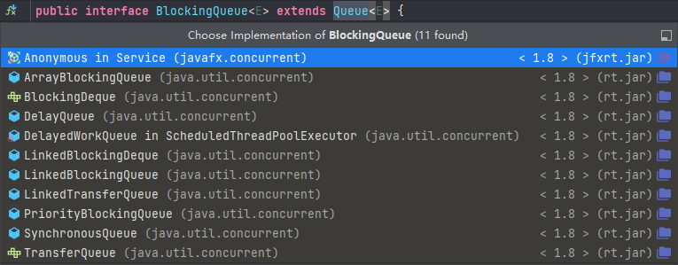

```java
interface BlockingQueue<E>
    -> extends Queue<E>
        -> extends Collection<E>
            -> extends Iterable<E>
```

`BlockingQueue`：

- 获取元素时等待队列变为非空

- 存储元素时等待空间变得可用

- 对于不能立即满足但可能在将来某一时刻可以满足的操作，以四种形式出现：
  1. 抛出异常
  2. 返回特殊值，`null || false`
  3. 在操作成功前，无限期阻塞当前线程
  4. 在给定的最大时间内阻塞当前线程
  
- **==核心方法==**

  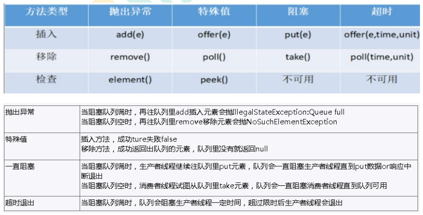

##### 7.1.5.1 ArrayBlockingQueue

> 由数组结构组成的**==有界==**阻塞队列。

基于数组的阻塞队列实现，在 ArrayBlockingQueue 内部，维护了一个定长数 组，以便缓存队列中的数据对象，这是一个常用的阻塞队列，除了一个定长数 组外，ArrayBlockingQueue 内部还保存着两个整形变量，分别标识着队列的 头部和尾部在数组中的位置。

**==ArrayBlockingQueue 在生产者放入数据和消费者获取数据，都是共用同一个 锁对象，由此也意味着两者无法真正并行运行==**，这点尤其不同于 LinkedBlockingQueue；按照实现原理来分析，ArrayBlockingQueue 完全可 以采用分离锁，从而实现生产者和消费者操作的完全并行运行。Doug Lea 之 所以没这样去做，也许是因为 ArrayBlockingQueue 的数据写入和获取操作已 经足够轻巧，以至于引入独立的锁机制，除了给代码带来额外的复杂性外，其 在性能上完全占不到任何便宜。 

##### 7.1.5.2 LinkedBlockingQueue 

>  由链表结构组成的**==有界（但大小默认值为 integer.MAX_VALUE）==**阻塞队列。

LinkedBlockingQueue 之所以能够高效的处理并发数据，还因为**==其对于生 产者端和消费者端分别采用了独立的锁来控制数据同步，这也意味着在高并发 的情况下生产者和消费者可以并行地操作队列中的数据，以此来提高整个队列 的并发性能==**。

##### 7.1.5.3 DelayQueue

> 使用优先级队列实现的延迟**==无界==**阻塞队列。

DelayQueue 中的元素只有当其指定的延迟时间到了，才能够从队列中获取到该元素。DelayQueue 是一个没有大小限制的队列，因此往队列中插入数据的操作**==（生产者）永远不会被阻塞，而只有获取数据的操作（消费者）才会被阻塞==**。

##### 7.1.5.4 PriorityBlockingQueue

> 支持优先级排序的**==无界==**阻塞队列。

基于优先级的阻塞队列（优先级的判断通过构造函数传入的 Compator 对象来决定），但需要注意的是 PriorityBlockingQueue 并**==不会阻塞数据生产者==**，而只会在没有可消费的数据时，阻塞数据的消费者。

在实现 PriorityBlockingQueue 时，内部控制线程同步的锁采用的是公平锁。

##### 7.1.5.5 SynchronousQueue

> 不存储元素的阻塞队列，也即单个元素的队列。

##### 7.1.5.6 LinkedTransferQueue

> 由链表组成的**==无界==**阻塞队列。

LinkedTransferQueue 是一个由链表结构组成的无界阻塞 TransferQueue 队 列。相对于其他阻塞队列，LinkedTransferQueue 多了 tryTransfer 和 transfer 方法。

##### 7.1.5.7 LinkedBlockingDeque

>  由链表组成的**==有界（但大小默认值为 integer.MAX_VALUE）==**双向阻塞队列。

LinkedBlockingDeque 是一个由链表结构组成的双向阻塞队列，即可以从队 列的两端插入和移除元素。

### 7.2 原子类

`AtomicLong` 等原子类是无锁的方案实现，最大的好处就是==**性能**==，无需加解锁、无需阻塞等待锁的线程。

#### 7.2.1 无锁方案的实现原理

硬件支持。CPU为了解决并发问题，提供了 CAS 指令（ Compare And Swap）。CAS 指令包含 3 个参数：共享变量的内存地址 A、用于比较的值 B 和共享变量的新值 C；并且只有当内存中地 址 A 处的值等于 B 时，才能将内存中地址 A 处的值更新为新值 C。**作为一条 CPU 指令， CAS 指令本身是能够保证原子性的。**

使用 CAS 来解决并发问题，一般都会伴随着自旋（循环尝试）：

```java
do {
    oldVal = ...; // 1
    newVal = ...; // 2
} while (
    val != cas(oldVal, newVal) // 3
);
```

- ==**切记在循环中获取 `oldVal`**==

  在循环外获取的话，如果刚好在获取到值但进入循环前被其他线程修改了之后，会陷入死循环

- `cas()` 中，将当前值 `val` 与 `oldVal` 比较，如果相同则替换新值 `newVal`，否则返回当前值 `val`

  ```java
  cas(T expect, T newVal) {
      // 读取目前值
      int cur = val;
      
      // 比较期望值
      if (cur == expect) {
          // 如果是，则更新
          val = newVal;
      }
      
      return cur;
  }
  ```

**但是在 CAS 方案中，存在一个 ABA 问题：“如果 `cas()` 返回的值不等于 `val`，意味着线程在执行完代码1之后3之前，有其他线程更新过 `val`”，那么“如果 `cas()` 返回的值等于 `val`，是否就能认定 `val` 没有被其他线程修改过吗？”，显然是不能的！**

假设原本 `val = A`，T1 在执行完代码1后执行3之前，有可能被 T2 修改为B，后续又被 T3 修改回了A，这样 T1 虽然一直看到的是A，但 `val` 已经是被更新过了的。原子化更新对象很可能需要关心这个问题，因为虽然两个对象相等，但其中的属性可能已经变化了。

==**ABA 问题如何解决？增加版本号维度。**==

#### 7.2.2 原子类

> Java SDK 并发包里提供的原子类内容很丰富，我们可以将它们分为五个类别：**原子化的基本数据类型、原子化的对象引用类型、原子化数组、原子化对象属性更新器和原子化的累加器**。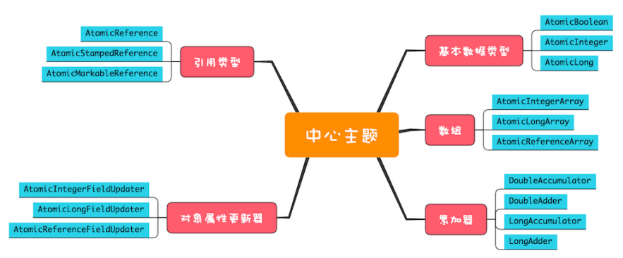

Java SDK 并发包里提供的原子类，使用的 `compareAndSet()` 来实现 `cas()`。

注意：原子化的对象引用中，`AtomicStampedReference` 和 `AtomicMarkableReference` 这两个原子类可以解决 ABA 问题。解决方案便是增加一个**版本号**维度。

## 八、线程池

一种线程使用模式。线程过多会带来调度开销，进而影响缓存局部性和整体性能，而线程池维护着多个线程，等待着监督管理者分配可并发执行的任务。这样**==避免了在处理短时间任务时创建与销毁线程的代价==**。

- 降低资源消耗：重复利用线程
- 提高响应速度：任务到达便能立即执行，无需等待线程创建
- 提高线程可管理性：线程是稀缺资源，统一管理能够提升系统稳定性，还能统一分配、监控

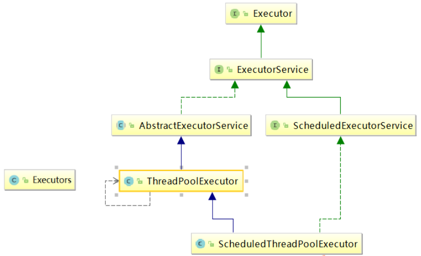

###  8.1 newFixedThreadPool

线程数量固定的线程池。如果因为在关闭前的执行期间出现异常导致线程终止，如果需要，一个新线程将代理它执行后续的任务。

```java
public static ExecutorService newFixedThreadPool(int nThreads) {
    return new ThreadPoolExecutor(nThreads, nThreads,
                                  0L, TimeUnit.MILLISECONDS,
                                  new LinkedBlockingQueue<Runnable>());
}
```

### 8.2 newSingleThreadExecutor

单线程线程池，以无界队列的方式来运行该线程。如果因为在关闭前的执行期间出现异常导致线程终止，如果需要，一个新线程将代理它执行后续的任务。

```java
public static ExecutorService newSingleThreadExecutor() {
    return new FinalizableDelegatedExecutorService
        (new ThreadPoolExecutor(1, 1,
                                0L, TimeUnit.MILLISECONDS,
                                new LinkedBlockingQueue<Runnable>()));
}
```

### 8.3 newCachedThreadPool

创建一个可缓存线程池，如果线程池长度超过处理需要，可灵活回收空闲线程，若无可回收，则新建线程。（随着任务的并发程度越高，创建的线程越多）

```java
public static ExecutorService newCachedThreadPool() {
    return new ThreadPoolExecutor(0, Integer.MAX_VALUE,
                                  60L, TimeUnit.SECONDS,
                                  new SynchronousQueue<Runnable>());
}
```

任务队列是 `SynchronousQueue`

### 8.4 newScheduleThreadPool

线程池支持定时以及周期性执行任务，创建一个 corePoolSize 为传入参 数，最大线程数为整形的最大数的线程池。

```java
public static ScheduledExecutorService newScheduledThreadPool(int corePoolSize) {
    return new ScheduledThreadPoolExecutor(corePoolSize);
}
```

### 8.5 newWorkStealingPool

JDK 1.8提供的线程池，底层使用 `ForkJoinPool` 实现，创建一个拥有多个任务队列的线程池，可以减少连接数，创建当前可用 CPU 核数的线程来并行执行任务。

```java
/**
 * Creates a thread pool that maintains enough threads to support
 * the given parallelism level, and may use multiple queues to
 * reduce contention. The parallelism level corresponds to the
 * maximum number of threads actively engaged in, or available to
 * engage in, task processing. The actual number of threads may
 * grow and shrink dynamically. A work-stealing pool makes no
 * guarantees about the order in which submitted tasks are
 * executed.
 *
 * @param parallelism the targeted parallelism level
 * @return the newly created thread pool
 * @throws IllegalArgumentException if {@code parallelism <= 0}
 * @since 1.8
 */
public static ExecutorService newWorkStealingPool(int parallelism) {
    return new ForkJoinPool
        (parallelism,
         ForkJoinPool.defaultForkJoinWorkerThreadFactory,
         null, true);
}

/**
 * Creates a work-stealing thread pool using all
 * {@link Runtime#availableProcessors available processors}
 * as its target parallelism level.
 * @return the newly created thread pool
 * @see #newWorkStealingPool(int)
 * @since 1.8
 */
public static ExecutorService newWorkStealingPool() {
    return new ForkJoinPool
        (Runtime.getRuntime().availableProcessors(),
         ForkJoinPool.defaultForkJoinWorkerThreadFactory,
         null, true);
}
```

- parallelism：并行级别，通常默认为 JVM 可用的处理器个数
- factory：用于创建 `ForkJoinPool` 中使用的线程
- handler：用于处理工作线程未处理的异常，默认为 null
- asyncMode：用于控制 WorkQueue 的工作模式：队列---反队列

### 8.6 七个参数

1. 核心线程数量 - 正式工

2. 最大线程数量 - 包含临时工的最大数

   **==什么时候创建临时工？==**

   1. 如果正在运行的线程数量小于 corePoolSize，那么马上创建线程运行这个任务
   2. 如果正在运行的线程数量大于或等于 corePoolSize，那么将这个任务放入队列
   3. 如果这个时候队列满了且正在运行的线程数量还小于 maximumPoolSize，那么创建非核心线程立刻运行这个任务
   4. 如果队列满了且正在运行的线程数量大于或等于 maximumPoolSize，那么线程池会启动饱和拒绝策略来执行

3. 空闲线程存活时间 - 临时工最大空闲时间

4. 存活时间单位

5. workQueue - 存放提交但未执行的任务

6. 线程创建工厂 - 创建线程（可省略）

7. handler - 等待队列满后的拒绝策略（可省略）

### 8.7 拒绝策略

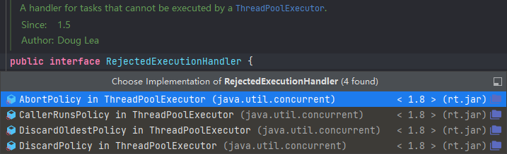

1. `AbortPolicy` - 抛出异常

   ```java
   public void rejectedExecution(Runnable r, ThreadPoolExecutor e) {
       throw new RejectedExecutionException("Task " + r.toString() +
                                            " rejected from " +
                                            e.toString());
   }
   ```

2. `CallerRunsPolicy` - 调用者运行

   ```java
   /**
    * Executes task r in the caller's thread, unless the executor
    * has been shut down, in which case the task is discarded.
    *
    * @param r the runnable task requested to be executed
    * @param e the executor attempting to execute this task
    */
   public void rejectedExecution(Runnable r, ThreadPoolExecutor e) {
       if (!e.isShutdown()) {
           r.run();
       }
   }
   ```

3. `DiscardOldestPolicy` - 抛弃等待最久的任务

   ```java
   /**
    * Obtains and ignores the next task that the executor
    * would otherwise execute, if one is immediately available,
    * and then retries execution of task r, unless the executor
    * is shut down, in which case task r is instead discarded.
    *
    * @param r the runnable task requested to be executed
    * @param e the executor attempting to execute this task
    */
   public void rejectedExecution(Runnable r, ThreadPoolExecutor e) {
       if (!e.isShutdown()) {
           e.getQueue().poll();
           e.execute(r);
       }
   }
   ```

4. `DiscardPolicy` - 对新任务不做任何处理

   ```java
   /**
    * Does nothing, which has the effect of discarding task r.
    *
    * @param r the runnable task requested to be executed
    * @param e the executor attempting to execute this task
    */
   public void rejectedExecution(Runnable r, ThreadPoolExecutor e) {
   }
   ```

### 8.8 自定义线程池

1. `FixedThreadPool & SingleThreadPool` 允许的请求队列（`LinkedBlockingQueue`）长度为 `Integer.MAX_VALUE`，可能会堆积大量任务导致OOM
2. `FixedThreadPool & CachedThreadPool & ScheduledThreadPool` 允许创建的线程数量最大为 `Integer.MAX_VALUE`，可能会创建大量线程导致OOM

因此建议自定义线程池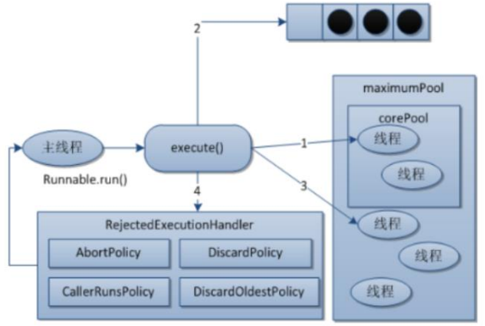

## 九、Future

### 11.1 Future

`Future` 接口有 5 个方法：

```java
// 取消任务
boolean cancel(boolean mayInterruptIfRunning);
// 判断任务是否已取消
boolean isCancelled();
// 判断任务是否已结束
boolean isDone();
// 获得任务执行结果
get();
// 获得任务执行结果，支持超时
get(long timeout, TimeUnit unit);
```

- 两个 `get()` 方法都是阻塞式

线程池使用 `execute(Runnable)` 提交任务，但是**无法获取任务的执行结果**，线程池提供了其他接口来获取任务的执行结果：

```java
// 提交 Runnable 任务
Future<?> submit(Runnable task);
// 提交 Callable 任务
<T> Future<T> submit(Callable<T> task);
// 提交 Runnable 任务及结果引用
<T> Future<T> submit(Runnable task, T result);
```

这三个 `submit()` 接口方法的返回值都是 `Future` 类型，三个方法简要介绍：

1. `submit(Runnable task)`

   方法参数是一个 `Runnable ` 接口，该接口是没有返回值的，所有这个方法返回的 `Future` 仅可以用来断言任务已经结束，类似于 `Thread.join()`

2. `submit(Callable<T> task)`

   方法参数是一个 `Callable ` 接口，该接口拥有一个带有返回值的方法：`V call() throws Exception;`，可以通过 `Future.get()` 来获取任务的执行结果

3. `submit(Runnable task, T result)`

   这个方法提供了两个参数，一个是不带返回结果的 `Runnable` 接口，另一个就是用于主线程与子线程沟通的桥梁 `T result`，通过 `Future.get()` 获取到的返回值便是传递给 `submit()` 方法的参数 `T result`，这样便得以使主线程通过它来与子线程共享数据

### 11.2 FutureTask

==**相比 `Runnable`，`Callable` 接口可以拥有返回值！**==

由于 `Thread` 不能直接接收 `Callable` 接口，因此需要一个辅助类：`FutureTask` 完成转换：

```java
public class FutureTask<V>
    implements RunnableFuture<V>
        extends Runnable, Future<V>

public void test() throws ExecutionException, InterruptedException {
    FutureTask<Integer> futureTask = new FutureTask<>(() -> {
        TimeUnit.SECONDS.sleep(5);
        return 10;
    });

    new Thread(futureTask, "deemo-thread-01").start();

    while (!futureTask.isDone()) {
        System.out.println("wait...");
    }
    System.out.println(futureTask.get());
    System.out.println("done.");
}
```

### 11.3 泡茶（一）

> 实现泡茶程序：==**分工、同步和互斥**==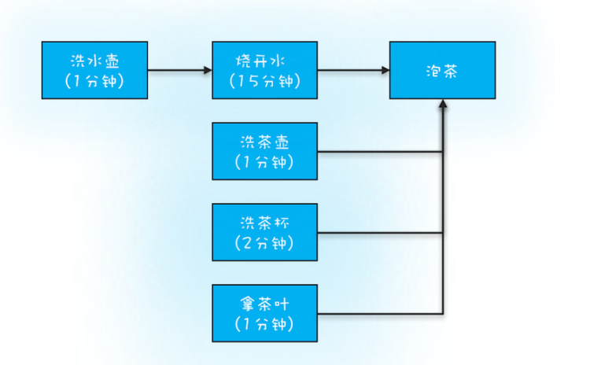

1. 分工

   使用两个线程来完成泡茶任务，T1 负责洗水壶、烧开水和泡茶，T2 负责洗茶壶、洗茶杯和拿茶叶

2. 同步

   T1 泡茶之前需要等待 T2 拿茶叶

3. 互斥

   暂无

使用 `Thread.join() || CountDownLatch` 都可以解决，尝试使用 `Future` 特性来实现：

- 两个线程对应两个 `FutureTask`
- 由于 T1 需要等待 T2 拿茶叶，所以 T1 中需要持有 T2 的 `FutureTask` 对象
- 

```java
// T1Task 需要执行的任务：
// 洗水壶、烧开水、泡茶
class T1Task implements Callable<String> {
    FutureTask<String> ft2;
    // T1 任务需要 T2 任务的 FutureTask
    T1Task(FutureTask<String> ft2){
        this.ft2 = ft2;
    }
    
    @Override
    String call() throws Exception {
        System.out.println("T1: 洗水壶...");
        TimeUnit.SECONDS.sleep(1);

        System.out.println("T1: 烧开水...");
        TimeUnit.SECONDS.sleep(15);
        // 获取 T2 线程的茶叶
        String tf = ft2.get();
        System.out.println("T1: 拿到茶叶:"+tf);
        System.out.println("T1: 泡茶...");
        return " 上茶:" + tf;
    }
}

// T2Task 需要执行的任务:
// 洗茶壶、洗茶杯、拿茶叶
class T2Task implements Callable<String> {
    @Override
    String call() throws Exception {
        System.out.println("T2: 洗茶壶...");
        TimeUnit.SECONDS.sleep(1);
        System.out.println("T2: 洗茶杯...");
        TimeUnit.SECONDS.sleep(2);
        System.out.println("T2: 拿茶叶...");
        TimeUnit.SECONDS.sleep(1);
        return " 龙井 ";
    }
}

// 一次执行结果：
T1: 洗水壶...
T2: 洗茶壶...
T1: 烧开水...
T2: 洗茶杯...
T2: 拿茶叶...
T1: 拿到茶叶: 龙井
T1: 泡茶...
上茶: 龙井
```

### 11.4 CompletableFuture

> ==**建议根据不同的业务创建不同的线程池，避免互相干扰**==
>
> **`CompletableFuture` 已经满足简单的异步编程需求，可以关注 `RxJava` 这个项目（`ReactiveX` 的 Java 实现），即便在 Java 1.6 版本也能享受异步编程的乐趣。**

创建 `CompletableFuture` 主要靠以下四个静态方法：

```java
// 使用默认线程池
static CompletableFuture<Void> runAsync(Runnable runnable) {}
static <U> CompletableFuture<U> supplyAsync(Supplier<U> supplier) {}

// 可以指定线程池
static CompletableFuture<Void> runAsync(Runnable runnable, Executor executor) {}
static <U> CompletableFuture<U> supplyAsync(Supplier<U> supplier, Executor executor) {}
```

- `runAsync` 和 `supplyAsync` 的区别在于前者没有返回值
- 前两个方法和后两个方法的区别在于后置可以指定线程池
- 默认情况下 `CompletableFuture` 会使用公共的 `ForkJoinPool` 线程池，这个线程池默认创建的线程数是 CPU 的核数（也可以通过 ` JVM option:- Djava.util.concurrent.ForkJoinPool.common.parallelism` 来设置线程数）
- 如果所有的 `CompletableFuture` 都共享一个线程池，那么一旦有线程执行一些很慢的 I/O 操作，就会导致线程池中的其他任务被阻塞执行造成**线程饥饿**，进而影响整个系统的性能。==**因此，建议根据不同的业务创建不同的线程池，避免互相干扰**==

### 11.5 泡茶（二）

```java
// 任务一
CompletableFuture<Void> cf1 = CompletableFuture.runAsync(() -> {
    System.out.println("T1: 洗水壶...");
    DeemoCompletableFuture.sleep(TimeUnit.SECONDS, 1);

    System.out.println("T1: 烧开水...");
    DeemoCompletableFuture.sleep(TimeUnit.SECONDS, 15);
});

// 任务二
CompletableFuture<String> cf2 = CompletableFuture.supplyAsync(() -> {
    System.out.println("T2: 洗茶壶...");
    DeemoCompletableFuture.sleep(TimeUnit.SECONDS, 1);

    System.out.println("T2: 洗茶杯...");
    DeemoCompletableFuture.sleep(TimeUnit.SECONDS, 2);

    System.out.println("T2: 拿茶叶...");
    DeemoCompletableFuture.sleep(TimeUnit.SECONDS, 1);

    return "红茶";
});

// 任务三：等待任务一和任务二完成后执行
CompletableFuture<String> cf3 = cf1.thenCombine(cf2, (__, name) -> {
    System.out.println("拿到茶叶：" + name);
    System.out.println("泡茶...");

    return "上等好茶：" + name;
});

// 等待任务一执行结束
System.out.println(cf3.get());
```

### 11.6 CompletableFuture 之 CompletionStage

> `CompletableFuture` 类还实现了 `CompletionStage` 接口，在 1.8 版本提供了40个方法！！如何理解？

站在分工的角度类比一下工作流：任务是由**时序关系**的，比如有==**串行、并行和汇聚**==等。类比烧水泡茶，其中洗水壶和烧开水是串行关系，洗水壶、烧开水和洗茶壶、洗茶杯这两组任务之间是并行关系，而烧开水、拿茶叶和泡茶就是汇聚关系。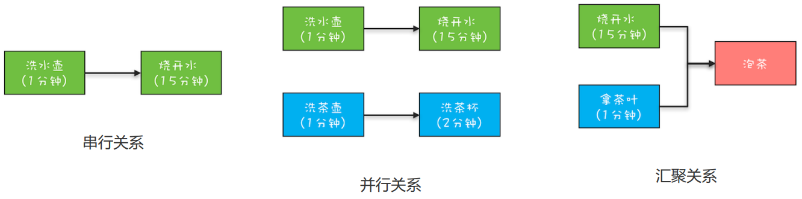

`CompletionStage` 接口可以清晰地描述任务之间的这种时许关系，例如 `cf1.thenCombine(cf2, (__, name) -> {})` 就是一种汇聚关系。烧水泡茶中的汇聚关系是一种==** AND 聚合关系**==（指依赖任务都完成后才开始执行当前任务）。既然有 AND 聚合关系，就一定还有 ==**OR 聚合关系**==（指依赖任务只要有一个完成就可以执行当前任务）。

在编程领域，还有一个绕不开的山头，那就是==**异常处理**==，`CompletionStage` 接口也能优雅地描述异常处理。

#### 11.6.1 串行关系

> `CompletionStage` 接口里描述串行关系主要是：`thenApply`、`thenAccept`、`thenRun` 和 `thenCompose` 这四个系列的接口。

- `thenApply` 系列函数里参数 `fn` 的类型是接口 `Function`，这个接口里与 `CompletionStage` 相关的方法是 `R apply(T t)`，这个方法既能接收参数也支持返回值，所以 `thenApply` 系列方法返回的是 `CompletionStage<R>`

-  `thenAccept` 系列方法里参数 `consumer` 的类型是接口 `Consumer`，这个接口里与 `CompletionStage` 相关的方法是 `void accept(T t)`，这个方法虽然支持参数，但却不支持回值，所以 `thenAccept`系列方法返回的是 `CompletionStage<R>`

- `thenRun` 系列方法里 `action` 的参数是 `Runnable`，所以 `action` 既不能接收参数也不支持返回值，所以 `thenRun` 系列方法返回的也是 `CompletionStage<Void>`

- ==**这些方法里面 `Async` 代表的是异步执行。**==其中，`thenCompose` 系列方法会新创建一个子流程，最终结果和 `thenApply` 系列相同

- 示例：

  ```java
  CompletableFuture<String> f0 =
   CompletableFuture.supplyAsync(
   () -> "Hello World") // ①
   .thenApply(s -> s + " QQ") // ②
   .thenApply(String::toUpperCase); // ③
  System.out.println(f0.join());
  // 输出结果
  HELLO WORLD QQ
  // 虽说是一个异步流程，但任务是①②③串行执行，③依赖②依赖①
  ```

```java
CompletionStage<R> thenApply(fn);
CompletionStage<R> thenApplyAsync(fn);
CompletionStage<Void> thenAccept(consumer);
CompletionStage<Void> thenAcceptAsync(consumer);
CompletionStage<Void> thenRun(action);
CompletionStage<Void> thenRunAsync(action);
CompletionStage<R> thenCompose(fn);
CompletionStage<R> thenComposeAsync(fn);
```

#### 11.6.2 AND 汇聚

> `CompletionStage` 接口里描述 AND 汇聚关系，主要是 `thenCombine`、`thenAcceptBoth`和 `runAfterBoth` 系列接口，这些接口的区别也是源自 `fn`、`consume` 和 `action` 这三个核心参数不同。

```java
CompletionStage<R> thenCombine(other, fn);
CompletionStage<R> thenCombineAsync(other, fn);
CompletionStage<Void> thenAcceptBoth(other, consumer);
CompletionStage<Void> thenAcceptBothAsync(other, consumer);
CompletionStage<Void> runAfterBoth(other, action);
CompletionStage<Void> runAfterBothAsync(other, action);
```

#### 11.6.3 OR 汇聚

> `CompletionStage` 接口里描述 AND 汇聚关系，主要是 `applyToEither`、`acceptEither`和 `runAfterEither` 系列接口，这些接口的区别也是源自 `fn`、`consume` 和 `action` 这三个核心参数不同。

```java
CompletionStage applyToEither(other, fn);
CompletionStage applyToEitherAsync(other, fn);
CompletionStage acceptEither(other, consumer);
CompletionStage acceptEitherAsync(other, consumer);
CompletionStage runAfterEither(other, action);
CompletionStage runAfterEitherAsync(other, action);
```

示例：

```java
CompletableFuture<String> f1 = CompletableFuture.supplyAsync(() -> {
    int t = getRandom(5, 10);
    sleep(TimeUnit.SECONDS, t);
    return String.valueOf(t);
});
CompletableFuture<String> f2 =CompletableFuture.supplyAsync(()->{
    int t = getRandom(5, 10);
    sleep(TimeUnit.SECONDS, t);
    return String.valueOf(t);
});
CompletableFuture<String> f3 = f1.applyToEither(f2, s -> s);

System.out.println(f3.join());
```

#### 11.6.4 异常处理

虽然上面提到的 `fn`、`consume` 和 `action` 它们的核心方法都**不允许抛出可检查异常，但不能限制它们抛出运行时异常**。非异步编程使用 `try-catch-finally` 来捕获处理异常，那么在异步编程里面，异常如何处理？

==**`CompletionStage` 提供的异常处理很简单，支持链式编程。**==

```java
CompletionStage exceptionally(fn);
CompletionStage<R> whenComplete(consumer);
CompletionStage<R> whenCompleteAsync(consumer);
CompletionStage<R> handle(fn);
CompletionStage<R> handleAsync(fn);
```

- `exceptionally()` 的使用类似于 `catch(e) {}`，支持链式编程，所以使用起来非常简单

  ```java
  CompletableFuture<Integer> f0 = CompletableFuture
      .supplyAsync(() -> 7 / 0))
      .thenApply(r -> r * 10)
      .exceptionally(e -> 0);
  
  System.out.println(f0.join());
  ```

- `whenComplete()` 和 `handle()` 系列方法就类似于 `finally() {}`，无论是否发生异常都会执行

### 11.7 CompletionService

> **`CompletionService` 可以优雅地批量提交异步任务，内部维护了一个阻塞队列，当任务执行结束就把任务的执行结果加入到阻塞队列中。**注意，是将 ==**`Future<V>` 对象**==加入到队列中。

`CompletionService` 接口的实现类是 `ExecutorCompletionService`，该类的构造方法：

- `ExecutorCompletionService(Executor executor)`
- `ExecutorCompletionService(Executor executor, BlockingQueue<Future<V>> completionQueue)`

这两个构造方法都需要传入一个线程池，如果不指定 `completionQueue` ，将会使用默认的无界 `LinkedBlockingQueue`

`CompletionService` 接口提供 5 个方法：

```java
Future<V> submit(Callable<V> task);
Future<V> submit(Runnable task, V result);

Future<V> take() throws InterruptedException;
Future<V> poll();
Future<V> poll(long timeout, TimeUnit unit) throws InterruptedException;
```

- `submit` 方法有二，区别在于 `Callable` 和 `Runnable` 的特性
- 其余三个方法都是和阻塞队列相关，`take()` 和 `poll()` 的区别在于当队列为空时，前者会被阻塞，后者返回 `NULL`

> 利用 `CompletionService` 实现 Dubbo 中的 Forking Cluster

Dubbo 中有一种叫做 Forking 的集群模式，这种集群模式下，支持并行地调用多个查询服 务，只要有一个成功返回结果，整个服务就可以返回了。

```java
CompletionService<Integer> cs = new ExecutorCompletionService<>(executor);
// 获取最快返回的任务执行结果
Integer r = 0;
try {
   // 只要有一个成功返回，则 break
   for (int i = 0; i < 3; ++i) {
       r = cs.take().get();
       // 简单地通过判空来检查是否成功返回
       if (r != null) {
           // 返回结果
           return r;
       }
   }
} finally {
   // 取消所有任务
   for (Future<Integer> f : futures) {
       f.cancel(true);
   }
}
```

## 十、Fork/Join


